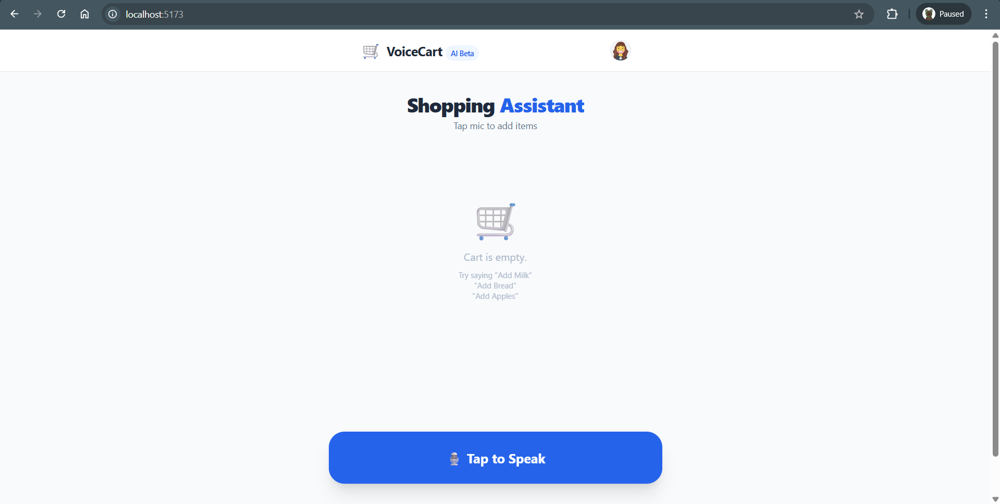
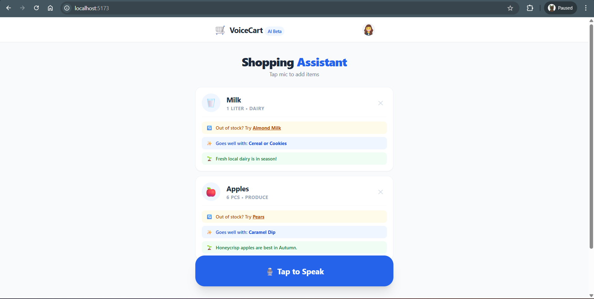

# 🛒 Voice Shopping Assistant

A robust, voice-activated shopping list application built with **React** and **TypeScript**. 
This project demonstrates a "Minimalist Interface" design and uses the **Web Speech API** for native voice recognition, paired with an AI simulation for smart product categorization and recommendations.

## 📸 Demo & UI

| **Smart Voice Interface** | **Intelligent Suggestions** |
|:-------------------------:|:---------------------------:|
|  |  |
| *Clean, glassmorphism UI with<br>native voice feedback loops.* | *Auto-categorization and<br>smart product substitutes.* |


## 🚀 Features

* **🎙️ Voice-to-Text**: Add items naturally using voice commands (e.g., *"Add 2 cartons of milk"*, *"Add apples"*).
* **🧠 Smart Categorization**: Automatically detects categories like *Dairy*, *Produce*, or *Bakery*.
* **💡 Intelligent Suggestions**:
    * **Substitutes**: Suggests alternatives if an item is out of stock.
    * **Complementary Items**: Recommends products that go well with your purchase.
    * **Seasonal Notes**: Highlights items currently in season.
* **📱 Mobile-First Design**: Glassmorphism UI with a large, thumb-accessible voice trigger.
* **⚡ Fallback Reliability**: Gracefully degrades to a robust local mode if AI services are unreachable.

## 🚀 Key Technical Highlights
* **⚛️ React Architecture**: Built with functional components and custom Hooks (useVoiceInput) for separated logic and view layers.

* **📘 TypeScript Precision**: Utilizes strict type safety and shared Interfaces to ensure a robust, error-free codebase.

* **⚡ Zero-Latency Performance**: Optimized for mobile and voice-only interactions with immediate visual feedback.

* **🧠 Intelligent Logic**: Simulates an NLP backend to parse natural language commands (e.g., "Add 5 organic apples") into structured data.

## 🛠️ Tech Stack

* **Frontend**: React (Vite) + TypeScript
* **Styling**: Tailwind CSS
* **Speech**: Native Web Speech API (Zero dependencies)
* **Logic**: Custom Hook (`useVoiceInput`) + AI Service Layer
* **AI**: Google Gemini API (`gemini-pro`)

## 🏃‍♂️ How to Run Locally

1.  **Clone the repository**
    ```bash
    git clone https://github.com/Ad1tyaKr/Shopping-Assistant
    cd voice-shopping-assistant
    ```

2.  **Install dependencies**
    ```bash
    npm install
    ```

3.  **Start the development server**
    ```bash
    npm run dev
    ```
> [!IMPORTANT]  
> **Evaluator Note: API Key & Mock Fallback**
> 
> To test the live AI integration, create a `.env` file in the root directory and add a valid Gemini API key:  
> `VITE_GEMINI_API_KEY=your_api_key_here`
> 
> **No API Key? No Problem.** 
> 
> The app automatically switches to Mock Data Mode if the key is missing or the API fails so you can still test all core features, including Voice-to-Text, Auto-Categorization, and Smart Suggestions, without any setup.
>

4.  **Open the App**
    * Visit `http://localhost:5173` in your browser.
    * **Note**: Please use **Google Chrome** or **Microsoft Edge** for full Web Speech API support.
    * Allow microphone permissions when prompted.

## 📂 Project Structure

```text
/src
├── /components     # UI Components (VoiceShoppingAssistant)
├── /hooks          # Custom Hooks (useVoiceInput)
├── /services       # Logic Layer (AI Service)
└── /types          # TypeScript Interfaces
└── /utils          # Helper functions (text formatters)
└── /assets         # Static Assests & Screenshots
└── App.tsx         # Main layout
└── main.tsx        # Entry point
